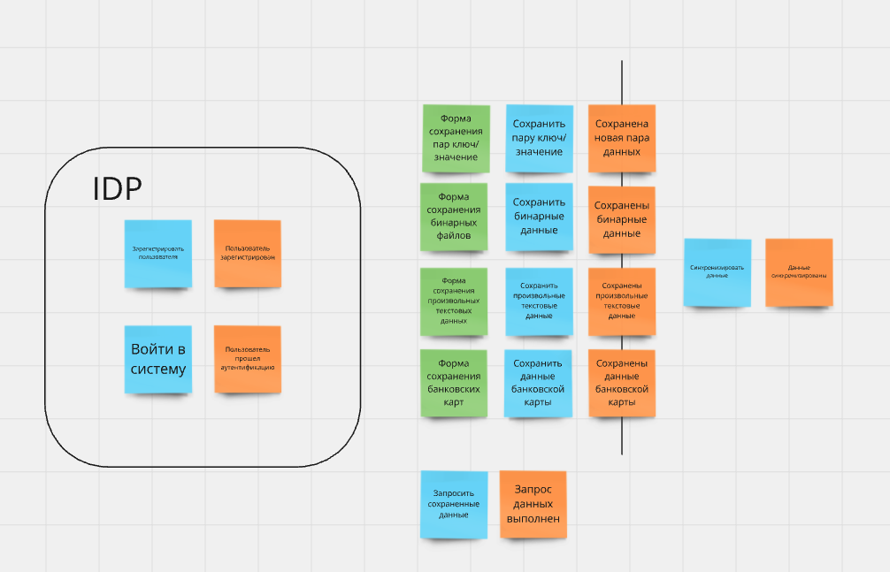
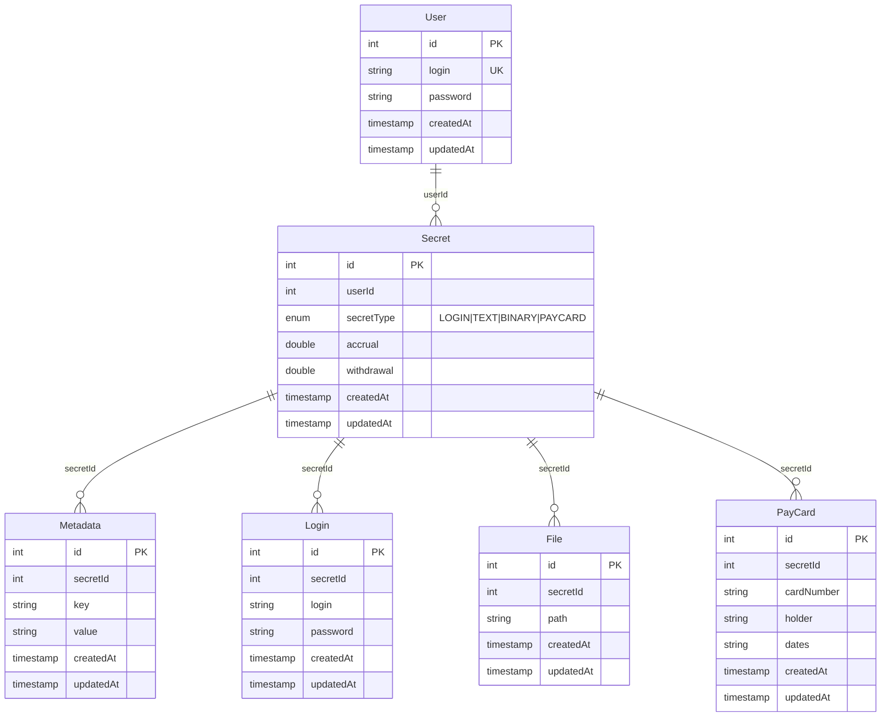

# Приватное хранилище информации GophKeeper
Второй выпускной проект на курсе "Продвинутый go разработчик".
## Общие требования
GophKeeper представляет собой клиент-серверную систему, позволяющую пользователю надёжно и безопасно хранить логины, пароли, бинарные данные и прочую приватную информацию.

Сервер должен реализовывать следующую бизнес-логику:
- регистрация, аутентификация и авторизация пользователей;
- хранение приватных данных;
- синхронизация данных между несколькими авторизованными клиентами одного владельца;
- передача приватных данных владельцу по запросу.

Клиент должен реализовывать следующую бизнес-логику:

- аутентификация и авторизация пользователей на удалённом сервере;
- доступ к приватным данным по запросу.

### Типы хранимой информации

- пары логин/пароль;
- произвольные текстовые данные;
- произвольные бинарные данные;
- данные банковских карт.

## Реализация

В нашем проекте мы будем использовать протокол gRPC на стримах на клиенте и сервере для реализации требования 
"синхронизация данных между несколькими авторизованными клиентами одного владельца".
Аутентификация будет простая по паре логин/пароль. Пароль будем хранить в виде хэша. При успешной аутентификации выдаем
JWT токен для решения задачи авторизации.

В системе будет реализован терминальный графический интерфейс с помощью пакета - https://github.com/rivo/tview.
В интерфейсе пользователь сможет: зарегистрироваться, зайти в аккаунт, посмотреть список доступного ему контента или загрузить новый.

### Хранение данных
#### Пары логин/пароль
Пары значений удобно хранить в реляционной субд. Выберем postgresql в качестве субд.
#### Произвольные текстовые данные
В postgresql мы могли бы использовать поле с типом text для хранения произвольных текстовых данных.
По условию задачу у нас не задан лимит. При уточнении задачи была получена информация, что может быть сохранено значение
размером > 1 гб. Мы не укладываемся в лимит размера у формата TOAST, поэтому не сможем хранить в субд эти данные. Мы можем 
сохранять эти данные в файл и хранить ссылку на файл в бд. Таким образом решение для хранения произвольных текстовых данных
будет похоже на хранение произвольных бинарных данных.
#### Произвольные бинарные данные
Для хранения бинарных файлов будем использовать minio. При уточнении задачи была получена информация, что 
сервис будет проверяться на фильме размером 10гб. Minio хорошо решает задачу с хранением файлов, поэтому отлично подойдет.
Также в нем мы будем хранить файлы с произвольными текстовыми данными.
#### Данные банковских карты
Данные карт будем хранить в postgresql. По условиям задачи нам не требуется выполнять условия GDPR, считаем что наш сервер
достаточно защищен и мы можем хранить эти данные у себя. Храним следующие данные:
- Номер карты
- Данные владельца карты
- Срок до которого карта активна
CVV код не храним в бд и не отображаем в форме для заполнения. Номер карты можем дополнительно провалидировать алгоритмом Луна.

### Event Storming системы "GophKeeper"
https://miro.com/app/board/uXjVKqtL9kQ=/?share_link_id=969528804638

### Таблицы бд

